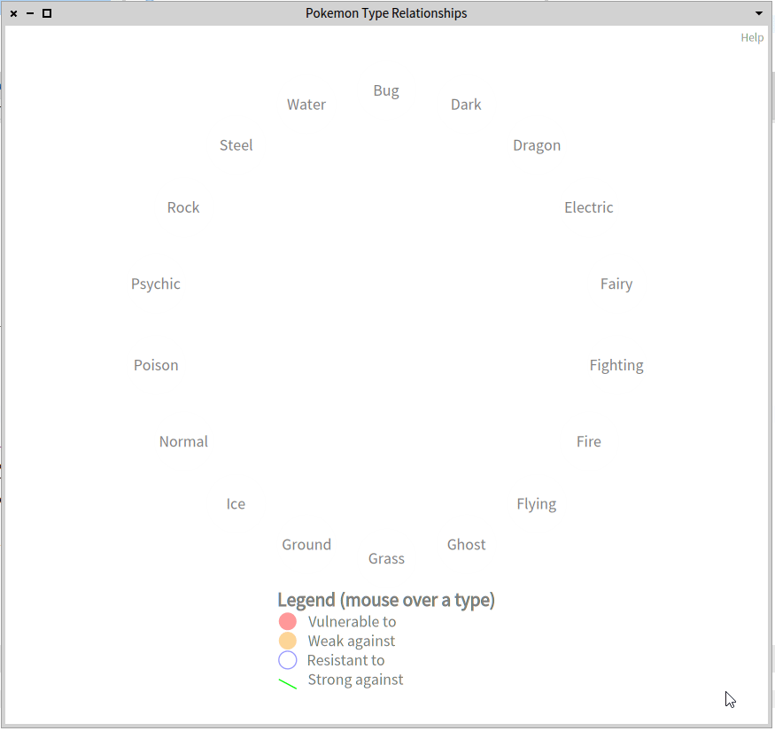

# PokemonAnalysis

Pharo visualization experiments with Pokemons (inspired by my kids).

## Browser for Pokemon Type Relationships

Done in Pharo 10.
Using [data from the web](https://www.eurogamer.net/pokemon-go-type-chart-effectiveness-weaknesses#section1) put into a .CSV file, this code uses NeoCSV to load it into a `PokemonType` class in Pharo. Roassal is used to display the data with interactions.



## Loads a CSV with NeoCSV

The following method was used to load the CSV file.
The file actually uses tabs to separate the columns (I copied it from the HTML table).
Since some cells have commas to separate list elements, I used `addField: converter:` to split out those data into collections.
Because some cells have nothing inside, NeoCSV never calls the mutators. 
It's necessary to have the `PokemonType` class return an empty collection in its accessors (rather than `nil`).

```st
readTypesFromCSV: fileDesc

	| stream reader splitAndTrim |
	stream := fileDesc asFileReference readStream.
	reader := NeoCSVReader on: stream.
	splitAndTrim := [ :l | (l splitOn: ',') collect: [ :s | s trim ] ].
	^ reader
		  separator: Character tab;
		  recordClass: self;
		  skipHeader;
		  addField: #typeName:;
		  addField: #strongAgainst: converter: splitAndTrim;
		  addField: #weakAgainst: converter: splitAndTrim;
		  addField: #resistantTo: converter: splitAndTrim;
		  addField: #vulnerableTo: converter: splitAndTrim;
		  upToEnd
```

## Loading this project by its baseline

Execute the following in a Playground:

```st
Metacello new
	githubUser: 'fuhrmanator' project: 'PokemonAnalysis' commitish: 'main' path: 'src';
	baseline: 'PokemonAnalysis';
	load
```

## Running the browser

Execute the following in a Playground:

```st
PokemonType start
```
